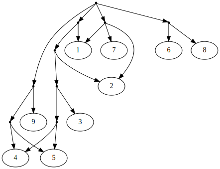

<!-- SPDX-License-Identifier: 0BSD -->

<!-- Logo. Tell markdownlint it's OK this precedes <h1>. -->
<!-- markdownlint-capture -->
<!-- markdownlint-disable MD041 -->

<!-- markdownlint-restore -->

# palgoviz - Materials for Python and algorithms, with visualization

This is a project to develop approaches and materials for teaching and learning
Python together with algorithms and data structures, with a substantial
component of visualization. The intended learner is (at least at this point)
expected to have substantial programming experience, but not necessarily any
experience in Python, and not necessarily any experience with algorithms and
data structures, other than the most basic topics such as using arrays.

[Graphviz](https://en.wikipedia.org/wiki/Graphviz) is heavily used for
visualizations. Not all topics have demos or exercises that produce
visualizations, and probably some never will (they may not always be helpful),
but most topics should eventually have them.

This project is a work in progress. It is unknown how comprehensive it will be,
or whether it will become a goal to produce materials that are ready-made for
widespread use (rather than requiring careful selection and customization). In
particular, classroom use is not currently a focus.

## License

palgoviz is licensed under [0BSD](https://spdx.org/licenses/0BSD.html) (the BSD
Zero Clause License). See [**`LICENSE`**](LICENSE).

0BSD is a [“public-domain
equivalent”](https://en.wikipedia.org/wiki/Public-domain-equivalent_license)
license. This is same license that [code examples in the Python
documentation](https://docs.python.org/3/license.html#terms-and-conditions-for-accessing-or-otherwise-using-python)
are offered under to ensure they can [always be reused without
impediment](https://github.com/python/cpython/pull/17635).

In addition, it is our intention that the 0BSD license applies retroactively to
all commits in the past history of this repository, from before licensing
information was added. The same permission, and warranty disclaimer, applies.

The most useful code and documentation is usually at the tip of the *main*
branch. But the process of developing the exercises, and various approaches to
working them—including exploration of bugs, both intentional and accidental—may
be of interest. Although that older content may be less useful, we want to make
clear that its use is in no way restricted.

## Authors

palgoviz is written by [David Vassallo](https://github.com/dmvassallo) and
[Eliah Kagan](https://github.com/EliahKagan).

## Installation

palgoviz should be installed [**using
`conda`/`mamba`**](doc/install-with-conda.md) or [**using
`poetry`**](doc/install-with-poetry.md). There is also an *experimental* [dev
container](doc/install-dev-container.md).

<small>(Although there’s [a PyPI package](https://pypi.org/project/palgoviz/), it
should [rarely be used](doc/dist-readme.md).)</small>

If you have no preference, `conda`/`mamba` is suggested. Condensed `conda`
instructions follow.

### Getting `conda`

If you don’t have `conda` already, we suggest
[Miniforge](https://github.com/conda-forge/miniforge), which is what we’re
using.

### Creating and using the environment

Clone the repository, go into its top-level directory, and create the conda
environment:

```sh
git clone https://github.com/EliahKagan/palgoviz.git
cd palgoviz
conda env create
```

Activate the environment:

```sh
conda activate palgoviz
```

You must activate the environment each time you use the project in a new shell
(or after deactivating it).

Create an “editable install” in the environment:

```sh
pip install -e .
```

That command only has to be run once, *not* each time you use the project.

## What’s here?

The most important and interesting parts of this project are the `palgoviz/`,
`tests/`, and `notebooks/` directories.

[Here’s the full list of directories and what each one is
for.](doc/project-dirs.md)

## Usage

You can open the top-level directory (the directory that contains this
`README.md` file) in an IDE or editor of your choice.

Visual Studio Code is suggested, and `.vscode/` has some useful configuration,
including for running tests using its test runner interface (the “beaker” icon
on the activity bar on the left). This configuration uses the `pytest` test
runner, which is capable of running all tests in the project.

If you use an IDE (which for this purpose includes VS Code), make sure to tell
it that this project uses the `palgoviz` environment, or verify that it has
detected this.

### Running tests

Tests can be run from VS Code or another IDE, but you may want to run them from
a terminal (and they may run faster that way, too).

To do that, first activate the `palgoviz` environment in your terminal if you
haven’t already. Assuming you’re using `conda`:

```sh
conda activate palgoviz
```

Make sure you are in the top-level directory (the directory that contains this
`README.md` file). Then run:

```sh
pytest --doctest-modules
```

If you want to use other test runners, including the `unittest` test runner,
the [more detailed documentation on running tests](doc/running-tests.md) has
information about that.

### Using the notebooks

JupyterLab is installed as a dependency of the project, and all notebooks are
tested in it. First activate the `palgoviz` environment in your terminal if you
haven’t already. Assuming you’re using `conda`:

```sh
conda activate palgoviz
```

It is best to run JupyterLab from the top-level directory (the directory that
contains this `README.md` file).

To run JupyterLab:

```sh
jupyter lab
```

[Click here for more info about using notebooks, and real-time collaboration
for notebooks and modules.](doc/using-notebooks.md)

## Quality

***palgoviz is a work in progress.***

Most functions and classes in modules (`.py` files) inside the `palgoviz/`
package are intended to be suitable for use as exercises, if you remove their
implementations other than the header and docstring. For a few, the suggested
way to “reset” them as exercises is different, and documented.

On the *main* branch, nearly all functions and classes in modules in
`palgoviz/` have been reviewed, and fully tested as exercises, by each of us.
We usually do not merge module code to *main* until this has been done.

The major exception, as of this writing, is `sll.py`, which has not yet been
doubly vetted in this way. The “`alr`” exercises in `recursion.py` have also
not been through this process (but the others there have).

*See [Code Quality Considerations](doc/quality.md) for more details.*

<!-- TODO: If we add an Acknowledgements sections, it could go here. -->

## Related work

This project is slightly related to a previous, less ambitious project,
[algorithms-suggestions](https://github.com/EliahKagan/algorithms-suggestions).

## Of interest

We are not affiliated with the following books in any way, and this project
does not adapt from or otherwise tie into them, but people interested in this
project may be interested in them as well:

- [Problem Solving with Algorithms and Data Structures using
  Python](https://runestone.academy/ns/books/published/pythonds/index.html) by
  Brad Miller and David Ranum
- [Fluent Python, Second Edition](https://www.fluentpython.com/) by Luciano
  Ramalho
