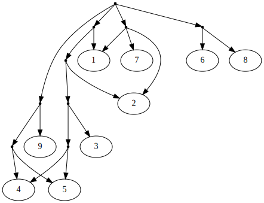

# algoviz

This is a project to develop approaches and materials for teaching and learning
Python together with algorithms and data structures, with a substantial
component of visualization. The intended learner is (at least at this point)
expected to have substantial programming experience, but not necessarily any
experience in Python, and not necessarily any experience with algorithms and
data structures, other than the most basic topics such as using arrays.

[Graphviz](https://en.wikipedia.org/wiki/Graphviz) is heavily used for
visualizations. Not all topics have demos or exercises that produce
visualizations, and probably some never will (they may not always be helpful),
but most topics should eventually have them.

This project is a work in progress. It is unknown how comprehensive it will be,
or whether it will become a goal to produce materials that are ready-made for
widespread use (rather than requiring careful selection and customization). In
particular, classroom use is not currently a focus.

<!--
    FIXME: Add "License" section; make other changes so the license is clear.

    1. A license file, which is best called LICENSE, must be added to the
       repository root (that is, the same directory this readme file is in).

    2. The section appearing here in this readme file should be called License,
       state the name of the license, and link to the license file in the
       repository using a relative path.

    3. We should consider stating, in this section, that the license extends to
       the contents of commits that were made before the license was added.
       This is usually unnecessary, but in this project, there is somewhat
       greater value in going back and using previously committed material.

    4. License headers should be added to all files where it is useful to have
       them. This includes, at minimum, every otherwise nonempty .py file in
       the repository.

    5. We should run https://github.com/licensee/licensee to find if there is
       anything that is likely to prevent GitHub from correctly recognizing and
       displaying license information when we later push the repository there.
       The first thing people (should) look for when looking at code is how the
       code is permitted to be used, and having that information immediately
       apparent is a benefit.
-->

## Installation

### Getting `conda`

This project is meant to be used in a Conda environment, so you need `conda`
(or `mamba`).

If you don't have it already, we suggested
[Miniforge](https://github.com/conda-forge/miniforge), which is what we're
using.

If you already have `conda` through another distribution, such as Miniconda or
Anaconda, that should be fine. (The `environment.yml` file states the channel
explicitly, rather than relying on channel defaults that vary across
distributions.)

### Optional: Using `mamba`

All the following `conda` commands can be run with `mamba` instead of `conda`
if you have `mamba` installed.

The exception is that, on Windows, `conda activate` and `conda deactivate`must
still be used on Windows (as of this writing). This is due tolimitations in
`mamba` PowerShell integration.

For commands that create and update the environment, `mamba` may be faster than
`conda`.

### Creating and and using the environment

1. Clone the repository and `cd` to its top-level directory.

2. Create the `conda` environment:

    ```sh
    conda env create
    ```

3. Activate the environment:

    ```sh
    conda activate algoviz
    ```

4. Create an "editable install" in the environment.

    ```sh
    conda develop .
    ```

    That command only has to be run once (unless you delete and recreate the
    environment or undo it with `conda develop --uninstall`). It is required to
    allow some modules to be run as scripts, and to be run from any location.
    Most of the project will work without it, but a small amount of
    functionality, and tests for that functionality, will fail without it.

    That command is analogous to using `pip install -e` when developing in a
    Python virtual environment rather than a Conda environment. (At this time,
    creating wheels from this project is not supported or considered valuable.)

It is suggested to proceed to the **What's here?** and **Usage** sections
below.

### Updating the environment

If you've just created the project, then it is already up to date (for now).
The following instructions are for later.

At this time, most project dependencies are not pinned, and dependencies may
continue to change as work proceeds further on the project. The following is
recommended for updating the project:


1. Activate the environment if it is not already active:

    ```sh
    conda activate algoviz
    ```

2. Update packages currently installed in the environment:

    ```sh
    conda update --all
    ```

3. Make sure you are in the top-level directory. That is the directory that
   contains `environment.yml` as well as this `README.md` file.

4. Install any new project dependencies, and remove any old dependencies that
   are known to no longer be needed:

   ```sh
   conda env update --prune
   ```

## What's here?

The most important and interesting parts of this project are the `algoviz/`,
`tests/`, and `notebooks/` directories. Here's a full list of directories:

### `algoviz`

This directory, not to be confused with the top-level repository directory,
contains Python modules (`.py` files), other than test modules.

Note that many tests are actually in these modules, because many of the tests
in this project are doctests, which appear in module, function, and class
docstrings.

### `tests`

Separate tests. Most of these are `.py` files that contain tests using the
`unittest` framework. There are also a few `.txt` files containing extended
doctests.

<!-- TODO: When pytest test modules are added, expand the above paragraph. -->

### `notebooks`

These are Jupyter notebooks showcasing Python and algorithms concepts, and
often tying in with code in `algoviz`.

### `notes`

These are files with information potentially relevant to preparing exercises
from the code in this project. It currently also contains some documentation in
rough draft form.

### `sandbox`

This presents traditional and namespace packages and shows how they behave
differently.

### `meta`

This contains files that are more about project internals than about Python,
algorithms and data structures, or even *use* of the project. This directory
may go away in the future.

## Usage

You can open the top-level directory (the directory that contains this
`README.md` file) in an IDE or editor of your choice.

Visual Studio Code is suggested, and `.vscode` has some useful configuration,
including for running tests using its test runner interface (the "beaker" icon
on the activity bar on the left). This configuration uses the `pytest` test
runner, which is capable of running all tests in the project.

If you use an IDE (which for this purpose includes VS Code), make sure to tell
it that this project uses the `algoviz` conda environment, or verify that it
has detected this.

### Running tests

Tests can be run from VS Code or another IDE, but you may want to run them from a terminal (and they may run faster that way, too).

To do that, first activate the `algoviz` Conda environment in your terminal if
you haven't already:

```sh
conda activate algoviz
```

Make sure you are in the top-level directory (the directory that contains this
`README.md` file). Then run:

```sh
pytest --doctest-modules
```

### Other test runners

Only the `pytest` test runner will run *all* tests in the project, but if you want to use the `unittest` test runner to run the `unittest` tests, you can:

```sh
python -m unittest
```

If you want to use the `doctest` test runner to run the doctests, you can:

```sh
python -m doctest algoviz/*.py tests/*.py tests/*.txt
```

That command is for a Unix-style shell. If you're using Windows, you're probably in PowerShell and should use:

```sh
python -m doctest (gci algoviz/*.py) (gci tests/*.py) (gci tests/*.txt)
```

The other commands are the same.

### Using the notebooks

JupyterLab is installed as a dependency of the project, and all notebooks are
tested in it. First activate the `algoviz` Conda environment in your terminal
if you haven't already:

```sh
conda activate algoviz
```

It is best to run JupyterLab from the top-level directory (the directory that
contains this `README.md` file). If you decided to skip the `conda develop`
installation step, then you must run it from there; otherwise, it is merely
recommended.

To run JupyterLab:

```sh
jupyter lab
```

### Real-time collaboration, on notebooks

The nature of this project is such that it may be useful to collaborate in real
time to explore it, rework parts of is as exercises, or expand it. For example,
this may facilitate cooperative learning or tutoring.

We tested the notebooks extensively, and developed many of them, using the
[Real Time
Collaboration](https://jupyterlab.readthedocs.io/en/stable/user/rtc.html)
feature of JupyterLab.

In simple use, this is done by running

```sh
jupyter lab --collaborative --ip ADDRESS
```

where `ADDRESS` is replaced by *your* IP address on the network interface
through which your machine is accessible from the outside, and then sharing the
link with collaborators.

<!-- FIXME: There should probably be more, or less, detail above. -->

### Real-time collaboration, on modules

You can use JupyterLab Real Time Collaboration for other kinds of files than
notebooks, but if you use some other IDE, you should check if it offers such a
feature of its own.

In particular, Visual Studio Code has [Visual Studio Live
Share](https://visualstudio.microsoft.com/services/live-share/). We used this
to develop substantial parts of this project. It was also a major part of how
we reimplemented and discussed most of the code in the `algoviz` package to
check that it was in good shape to be (re)worked as exercises.

<!-- FIXME: Add an Acknowledgements section. -->

## Related work

This project is slightly related to a previous, less ambitious project,
[algorithms-suggestions](https://github.com/EliahKagan/algorithms-suggestions).


## Of interest

We are not affiliated with the following books in any way, and this project
does not adapt from or otherwise tie into them, but people interested in this
project may be interested in them as well:

- [Problem Solving with Algorithms and Data Structures using
  Python](https://runestone.academy/ns/books/published/pythonds/index.html) by
  Brad Miller and David Ranum

- [Fluent Python, Second Edition](https://www.fluentpython.com/) by Luciano
  Ramalho
